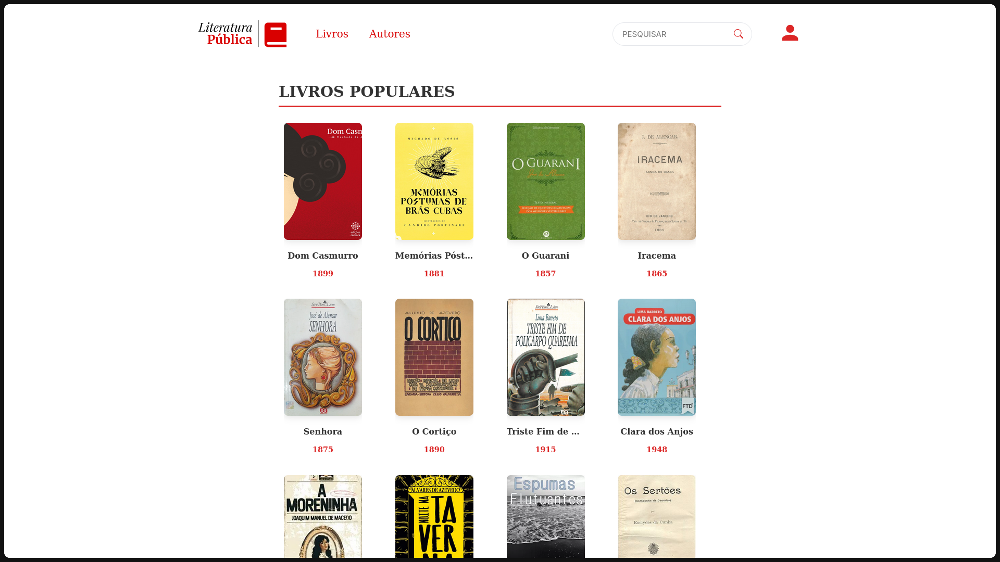
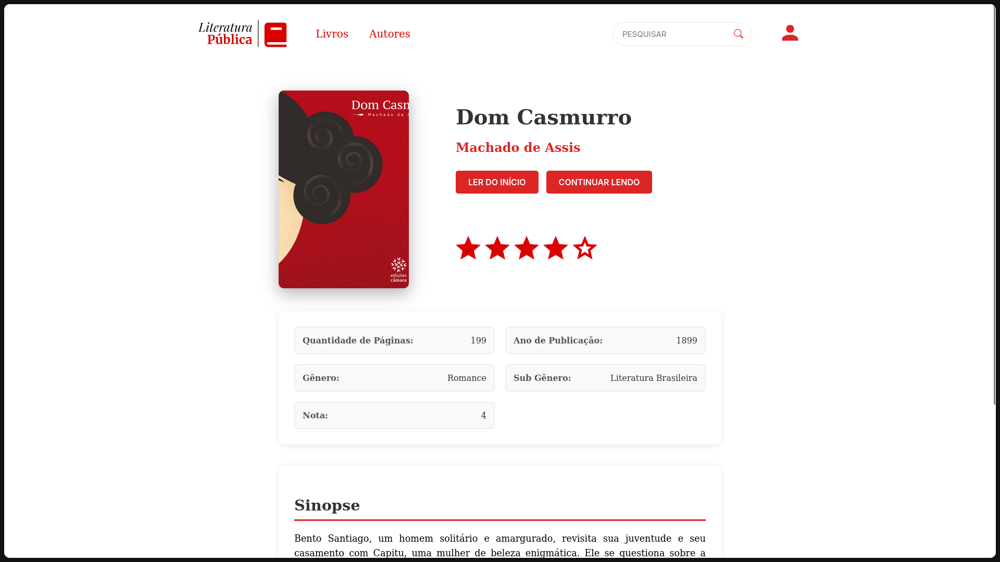
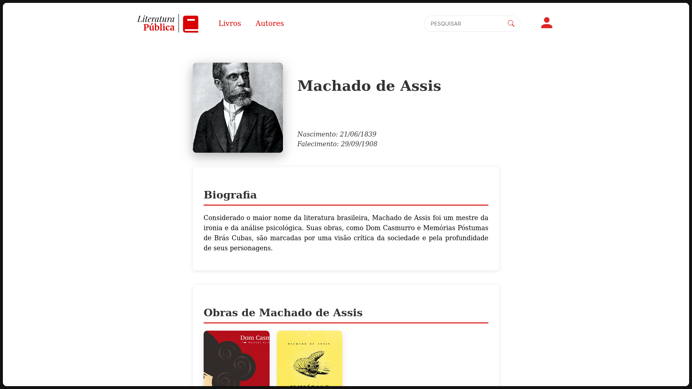
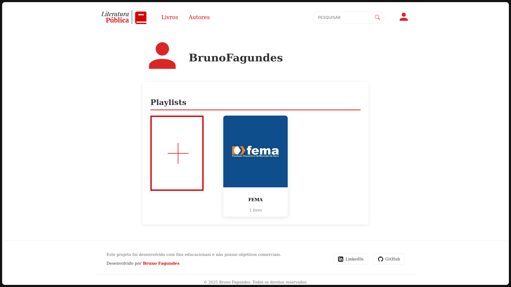
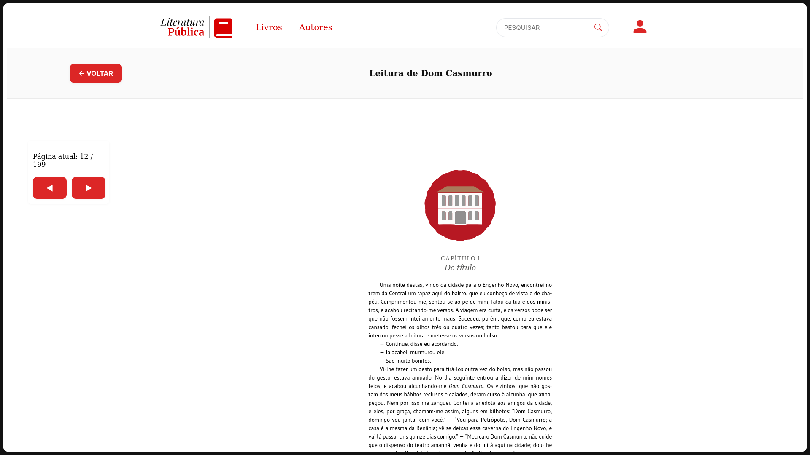
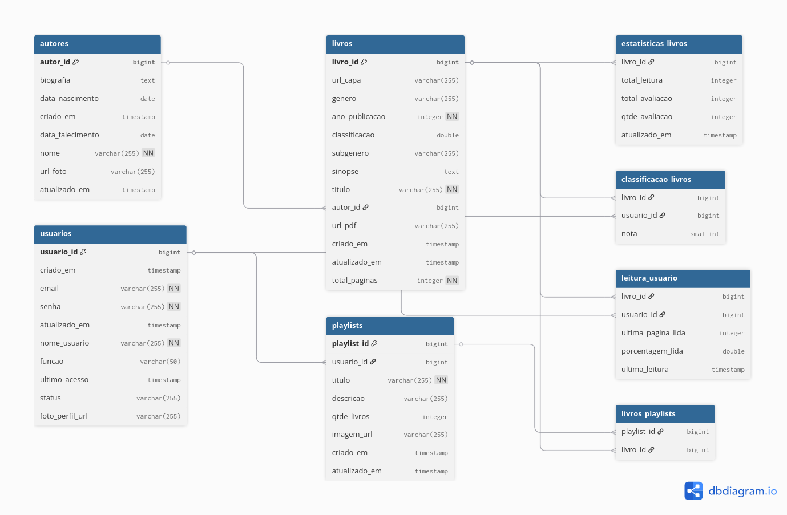

# Literatura Pública

Aplicação Web para a leitura de livros em domínio público. 

# Telas da aplicação 

## Tela Inicial 

Contém os livros e os autores disponíveis no site que podem ser vistos de forma paginada

## Tela Inicial



## Tela do livro (Usuário autenticado)



## Tela do autor



## Tela do usuário 



## Tela de leitura do livro



# Tecnologias Utilizadas

**Backend:** Java 17, Spring Boot

**Frontend:** Angular 19, ng2-pdf-viewer (biblioteca javascript para executar o pdf direto no navegador)

**Banco de Dados**: PostgreSQL

**Diagrama do Banco de dados**:



## Como utilizar  

Para executar o projeto localmente pode-se utilizar do Docker ou executar os comandos para execuatar o backend e o frontend separadamente. 

Docker é uma plataforma de código aberto que permite criar, implantar e gerenciar aplicações em contêineres. Que facilitam a execução de um projeto para quem for executar fora do ambiente em que foi criado o sistema. Será necessário instalar a versão desktop.

Docker: https://www.docker.com/

Com Docker:

```bash
docker-compose up ou docker compose up
```

Sem Docker:

```bash
Dentro da pasta raiz do projeto
./mvnw spring-boot:run -f backend/pom.xml

Dentro da pasta frontend

npm install
ng serve --proxy-config proxy.conf.json
```

## Autor

- [@Bruno-Fagundes](https://www.github.com/Bruno-Fagundes)


